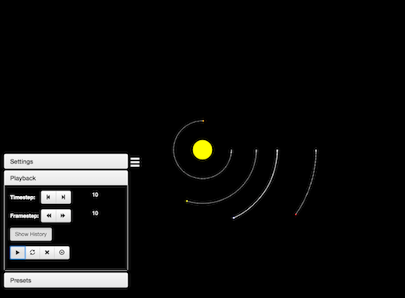
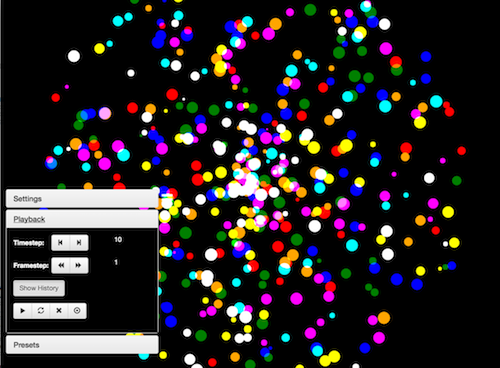
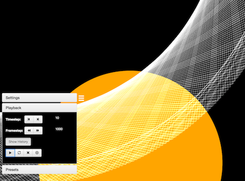

# OrbitalSimulator
A desktop application that simulates orbits and gravity.

### Milky Way Simulation

### Galaxy Cluster

### Precision Orbit Tracking

## Installation

1. Clone this repo
2. In /OrbitalSimulator/ run `npm install && npm start`
3. Press the hamburger button in the bottom left corner and have fun
