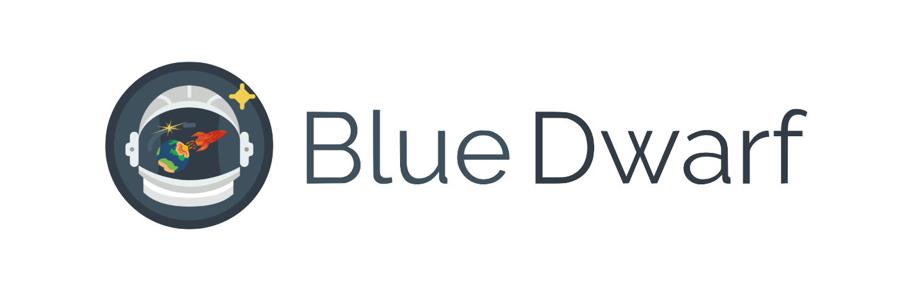
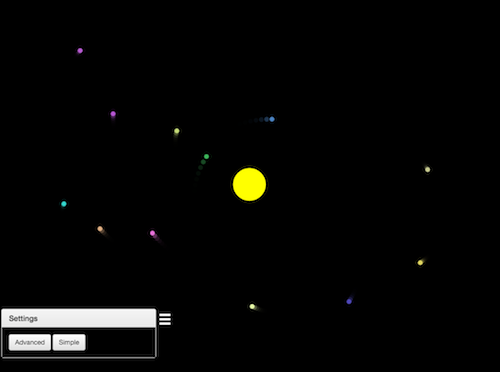

[](https://github.com/jacobsteves/Blue-Dwarf/releases/)

A desktop application that simulates orbits and gravity. Users can customize their own orbits and create their own planetary systems! Provides a full N-body simulation, as well as a simple mode allowing the user to just click around and spawn in planets, so no physics knowledge is needed.

Milky Way Simulation       |  Precision Orbit Tracking
:-------------------------:|:-------------------------:
   |  

## Getting Started
### Prerequisites
- We use [npm](https://www.npmjs.com/) for our main package manager
- However, feel free to use [yarn](https://yarnpkg.com/en/) or any other package manager

### Installation

1. Clone this repo
2. In this directory, run:
```
 npm install && npm start
```
3. Press the hamburger button in the bottom left corner and have fun

## Building
To build a publish ready version of the app, in this directory, run:

```
npm dist
```

This will create a build that is native to your OS. 


Building the app for multiple operating systems at once is not recommended because of the compliation errors that often arise, but you can run:

```
npm dist-all
```

If you're brave enough.

## Features
- Two modes
     - Advanced: larger simulation details
     - Simple: black hole type planet spawning
- Full N-body simulation (simulation of a dynamical system of particles)
- Play, pause, restart simulations
- You can use preset planitary systems, create your own, or edit the presets
- Record and export a gif of the simulation
- Object collisions
- Watch orbit track

### Demo

Sample Screen              |  Galaxy Cluster
:-------------------------:|:-------------------------:
     |  

## Use
- Click the hamburger button in the bottom left of the screen
- Maneuver through the menu system
- If on Advanced, place your planets/choose your preset and then click Playback > Play

## Versioning

We use [SemVer](http://semver.org/) for versioning. For the versions available, see the [tags on this repository](https://github.com/jacobsteves/Blue-Dwarf/tags). 

## Built With

- [Electron](https://github.com/electron/electron) - To program the cross-platform app
- [Electron Builder](https://github.com/electron-userland/electron-builder) - To build a publish ready version of the app

## License

This project is licensed under the MIT License - see the [LICENSE](LICENSE) file for details
